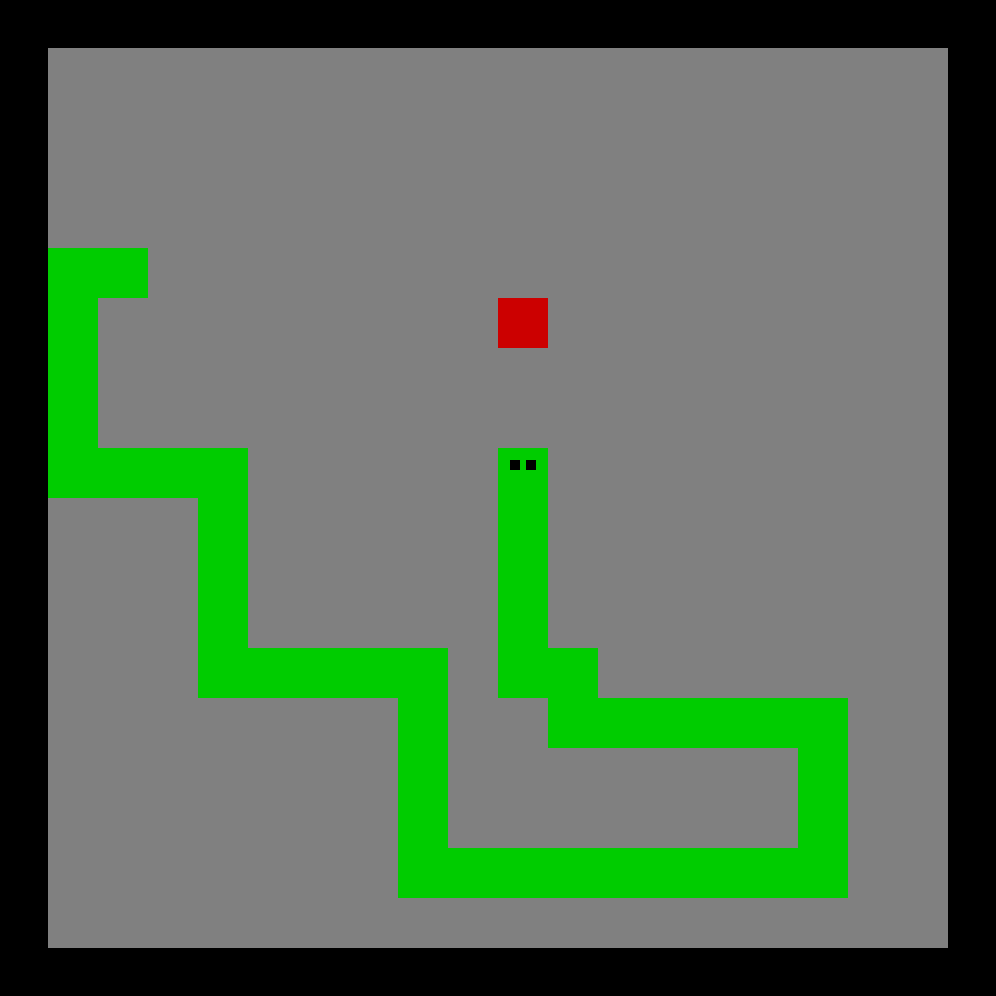

# Snake

The classic Snake game written in Rust using the Piston game engine.



# Instructions

Use the arrow keys to move. Press escape to quit. The snake grows when it eats food. The snake dies when it runs into itself or the walls.

# Running

```sh
cargo build
cargo run
```
